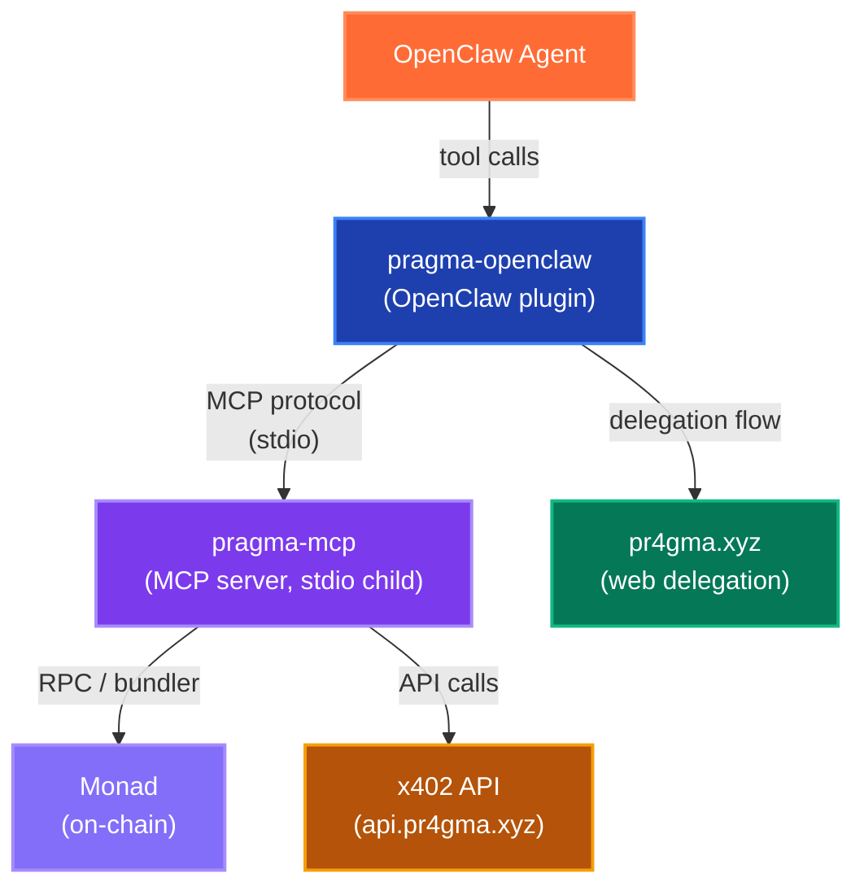
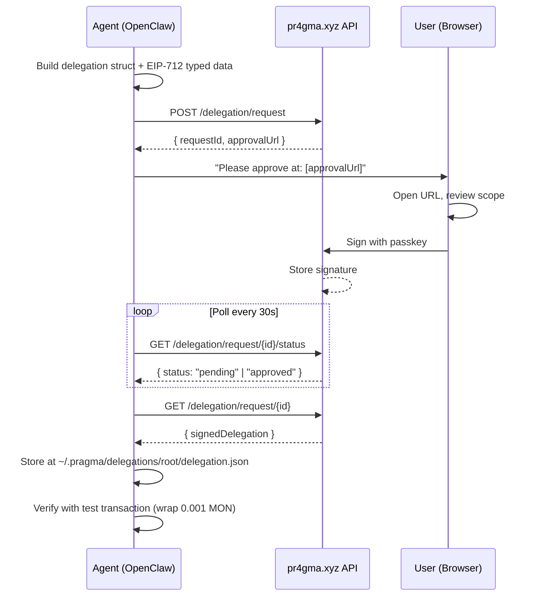
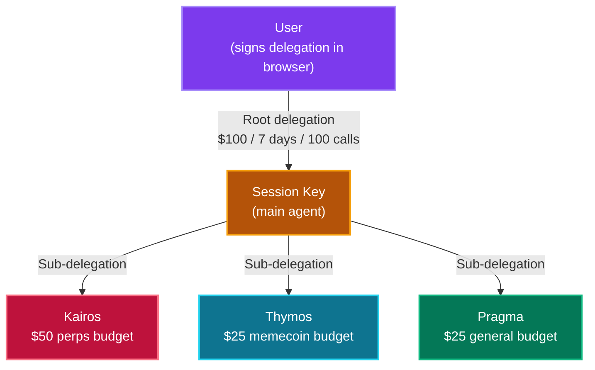
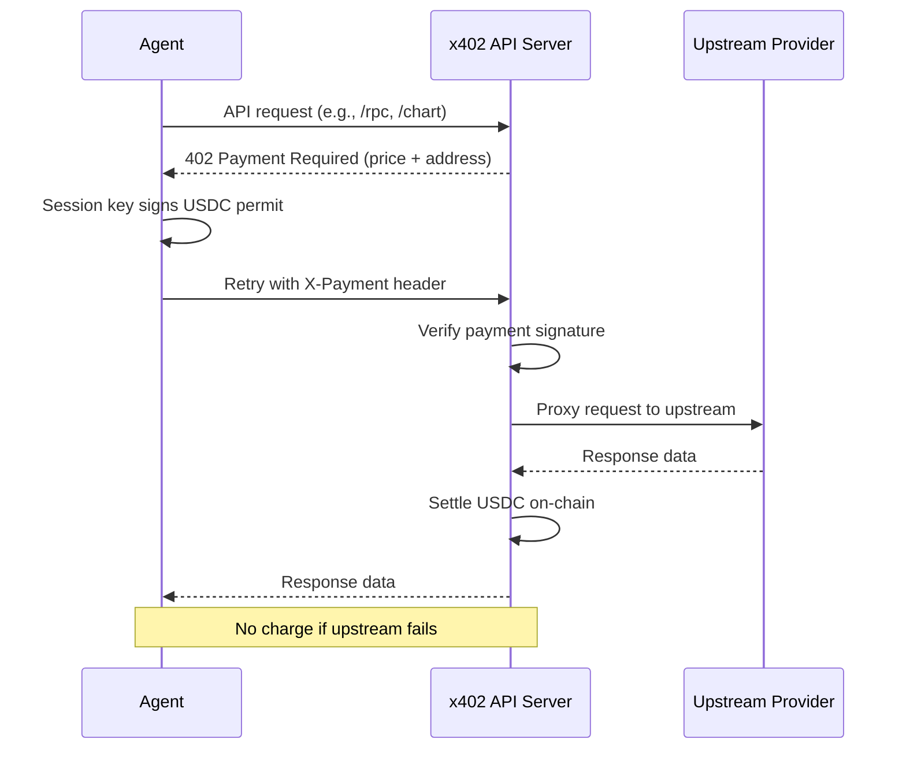

# pragma

> Vibetrading for OpenClaw

[](https://openclaw.ai)
[](https://monad.xyz)
[](https://www.npmjs.com/package/pragma-openclaw)
[](CHANGELOG.md)
[](LICENSE)

> **Beta Software.** pragma is experimental and under active development. Trading involves risk of loss — use at your own discretion and never trade more than you can afford to lose.

pragma is an [OpenClaw](https://openclaw.ai) plugin that turns OpenClaw agents into on-chain trading agents. Swap tokens, trade perpetuals, scalp memecoins, analyze markets, and run autonomous trading agents — all through natural conversation.

**Currently live on [Monad](https://monad.xyz).** Built with [MetaMask Smart Accounts Kit](https://docs.metamask.io/smart-accounts-kit/) and [x402](https://www.x402.org/) (pay-per-API-call with USDC — no keys to configure).

> **Headless by design.** pragma-openclaw runs on Linux servers without macOS, Touch ID, or Keychain. Session keys are stored as encrypted files. Delegations are approved through a web flow at [pr4gma.xyz](https://pr4gma.xyz) — the user signs with their passkey in the browser, and the agent retrieves the signed delegation via polling.

## Table of Contents

- [pragma vs pragma-openclaw](#pragma-vs-pragma-openclaw)
- [Features](#features)
- [Installation](#installation)
- [Quick Start](#quick-start)
- [Commands](#commands)
- [Modes](#modes)
- [Tools](#tools)
- [How It Works](#how-it-works)
  - [Architecture](#architecture)
  - [Session Keys](#session-keys)
  - [Delegations](#delegations)
  - [Web Delegation Flow](#web-delegation-flow)
  - [Autonomous Agents](#autonomous-agents)
  - [Security Model](#security-model)
  - [x402 Protocol](#x402-protocol)
- [Pricing](#pricing)
- [Requirements](#requirements)
- [Troubleshooting](#troubleshooting)
- [Acknowledgments](#acknowledgments)
- [Support](#support)
- [License](#license)

---

## pragma vs pragma-openclaw

pragma exists as two plugins for two different agent runtimes. Same wallet, same tools, different platforms.

|                        | pragma (Claude Code)               | pragma-openclaw (OpenClaw)                |
| ---------------------- | ---------------------------------- | ----------------------------------------- |
| **Runtime**            | Claude Code CLI / Desktop / Cowork | OpenClaw                                  |
| **Platform**           | macOS only                         | Linux servers (headless)                  |
| **Key storage**        | macOS Keychain + Touch ID          | File-based (`~/.pragma/session-key.json`) |
| **Delegation signing** | Touch ID (local biometric)         | Web approval at pr4gma.xyz                |
| **Autonomous agents**  | Claude Code agent teams            | OpenClaw `sessions_spawn`                 |
| **Package**            | `pragma` (Claude Code marketplace) | `pragma-openclaw` (npm)                   |
| **MCP bridge**         | Native (runs MCP server directly)  | Child process (stdio transport)           |

If you're on macOS and using Claude Code, use [pragma](https://github.com/s0nderlabs/pragma). If you're running OpenClaw agents on a server, you're in the right place.

---

## Features

**Trading**

- Token swaps via DEX aggregator (best route, batch support)
- Perpetual futures on [LeverUp](https://leverup.xyz) (up to 1001x leverage, 20 pairs)
- Memecoin trading on [nad.fun](https://nad.fun) bonding curves
- Wrapping and transfers

**Market Intelligence**

- OHLCV charts from Pyth oracles (all timeframes)
- Economic calendar, central bank speeches, critical news
- Currency strength matrix, FX reference rates
- Funding rates, open interest, squeeze detection

**Autonomous Trading**

- Three specialized agents: Kairos (perps), Thymos (memecoins), Pragma (general)
- Background trading via OpenClaw `sessions_spawn`
- On-chain budget enforcement via smart contract caveats
- Multi-agent coordination with independent wallets

**On-Chain Analysis**

- Transaction decoding and explanation
- Contract analysis (ABI, proxy detection, security notes)
- Activity history with token flow tracking

---

## Installation

Install via OpenClaw CLI:

```bash
openclaw plugins install pragma-openclaw
```

On first load, the plugin automatically:

1. Creates a session key at `~/.pragma/session-key.json` (secp256k1, `0600` permissions)
2. Creates a config at `~/.pragma/config.json` (Monad mainnet, chainId 143)
3. Spawns the pragma MCP server as a child process
4. Discovers and registers all available tools with the OpenClaw API

Then run setup through the agent:

```
Set up pragma
```

The agent will guide you through linking your Smart Account and creating a trading delegation.

### Plugin Configuration

Optional settings in your OpenClaw config:

```json
{
  "plugins": {
    "pragma-openclaw": {
      "mode": "x402",
      "configPath": "~/.pragma/config.json",
      "sessionKeyPath": "~/.pragma/session-key.json"
    }
  }
}
```

| Option           | Default                      | Description                                                   |
| ---------------- | ---------------------------- | ------------------------------------------------------------- |
| `mode`           | `x402`                       | API mode: `x402` (paid) or `byok` (free, bring your own keys) |
| `configPath`     | `~/.pragma/config.json`      | Path to pragma config file                                    |
| `sessionKeyPath` | `~/.pragma/session-key.json` | Path to session key file                                      |

---

## Quick Start

Once set up, just talk to the agent:

```
What's my balance?
```

```
Swap 1 MON for USDC
```

```
Show me the BTC chart on the 4H timeframe
```

```
Open a 10x long on ETH with 5 LVUSD margin, SL at $2,200
```

```
What's trending on nad.fun?
```

```
Run kairos with $50 budget for 7 days — trade perps, focus on macro setups
```

pragma activates automatically when you mention anything related to trading, wallets, tokens, or on-chain operations.

---

## Commands

| Skill               | Description                                   |
| ------------------- | --------------------------------------------- |
| `pragma-setup`      | First-time onboarding and wallet setup        |
| `pragma-delegation` | Create, renew, and manage trading delegations |
| `pragma-core`       | Trading, market intelligence, wallet ops      |
| `pragma-autonomous` | Background agent trading with sub-agents      |
| `pragma-mode`       | Switch between BYOK and x402 modes            |

For everything else — swaps, transfers, balances, trading — just describe what you want in plain English. Skills activate automatically based on intent.

---

## Modes

pragma operates in two modes.

### x402 Mode (Default)

Pay-per-API-call using USDC from your session key. No API keys to configure — everything works out of the box.

New wallets get **50 free API calls** to bootstrap (enough to swap MON for USDC and fund your session key). After that, calls cost fractions of a cent each.

### BYOK Mode (Free)

Bring Your Own Keys. You provide RPC, bundler, quote, and data API endpoints. The plugin is free — you only pay your own API providers.

---

## Tools

pragma provides **54+ MCP tools** across 12 categories, bridged from the pragma-mcp server to the OpenClaw API.

| Category    | Tools | Description                                                                             |
| ----------- | ----- | --------------------------------------------------------------------------------------- |
| Setup       | 4     | Wallet setup, mode switching, provider config                                           |
| Balance     | 3     | Token balances, portfolio, account info                                                 |
| Tokens      | 2     | Token lookup, verified token list                                                       |
| Trading     | 2     | DEX quotes (single + batch), swap execution                                             |
| Transfers   | 3     | Send tokens, wrap/unwrap MON                                                            |
| Session Key | 3     | Gas funding, balance check, withdrawal                                                  |
| Blockchain  | 2     | Block info, gas price                                                                   |
| Analysis    | 3     | Transaction decoding, activity history, contract analysis                               |
| nad.fun     | 7     | Status, discover, quote, buy, sell, positions, token info                               |
| LeverUp     | 12    | Pairs, positions, quotes, open/close, margin, TP/SL, limit orders, stats, funding rates |
| Market      | 8     | Charts, economic events, news, FX rates, currency strength, CB speeches                 |
| Delegation  | 4     | Web-based delegation request, poll, retrieve, session setup                             |
| Sub-Agents  | 8     | Create, fund, revoke, status, journal, wallet pool                                      |

**Blocked tools:**

| Tool | Why Blocked | Alternative |
|------|-------------|-------------|
| `create_root_delegation` | Requires passkey signing via macOS Touch ID (`pragma-signer` binary). The delegation struct must be signed by the P-256 passkey stored in macOS Keychain — there's no headless equivalent for this signature type. | Use `request_delegation` → web approval at pr4gma.xyz (user signs with passkey in browser) |
| `nadfun_create` | Deploying a new token on nad.fun requires a direct passkey signature from the smart account owner. This operation can't go through the delegation chain because nad.fun's factory contract requires the account itself to call `create()`, not a delegate. | Not available on this platform — create tokens from macOS CLI or pragma wallet |

---

## How It Works

### Architecture

pragma-openclaw is an OpenClaw plugin that bridges the pragma MCP server into the OpenClaw agent runtime.



On startup, the plugin:

1. Generates or loads a file-based session key (secp256k1)
2. Ensures `~/.pragma/config.json` exists with Monad mainnet settings
3. Spawns `pragma-mcp` as a child process via stdio transport
4. Discovers all MCP tools and registers them individually with OpenClaw
5. Registers delegation gateway methods (RPC endpoints + agent tools)

The MCP bridge uses `@modelcontextprotocol/sdk` Client with `StdioClientTransport`. Every tool call from the agent is proxied through the bridge to the MCP server.

### Session Keys

On OpenClaw (Linux), session keys are **file-based** instead of Keychain-based.

| Aspect      | pragma (macOS)                            | pragma-openclaw (Linux)              |
| ----------- | ----------------------------------------- | ------------------------------------ |
| Key type    | secp256k1                                 | secp256k1                            |
| Storage     | macOS Keychain (`xyz.pragma.session-key`) | File (`~/.pragma/session-key.json`)  |
| Permissions | Keychain ACL (per-app)                    | `0600` (owner read/write only)       |
| Touch ID    | Not required to read                      | N/A                                  |
| Generation  | `viem/accounts` `generatePrivateKey`      | `viem/accounts` `generatePrivateKey` |

The session key is a standard Ethereum EOA that the agent uses for:

- **Gas payments:** Holds MON for transaction gas
- **x402 micropayments:** Signs USDC payment authorizations for API calls
- **Delegation execution:** Submits `redeemDelegations()` transactions on-chain

The session key cannot move funds from your smart account on its own. It can only execute operations through delegations that you've signed with your passkey.

### Delegations

Delegations are signed on-chain permissions that authorize the agent to trade through your Smart Account. They use [MetaMask Smart Accounts Kit](https://docs.metamask.io/smart-accounts-kit/) caveats (enforcers) to constrain scope:

| Caveat                       | What It Enforces                                            |
| ---------------------------- | ----------------------------------------------------------- |
| **TimestampEnforcer**        | Delegation expires after a set time                         |
| **LimitedCallsEnforcer**     | Maximum number of on-chain calls                            |
| **ValueLteEnforcer**         | Maximum MON per transaction                                 |
| **AllowedTargetsEnforcer**   | Whitelist of contract addresses                             |
| **AllowedMethodsEnforcer**   | Whitelist of function selectors                             |
| **AllowedCalldataEnforcer**  | Whitelist of calldata patterns (transfer recipients)        |
| **LogicalOrWrapperEnforcer** | Groups caveats with OR logic (approve OR trade OR transfer) |

These are enforced by smart contracts on-chain. The agent cannot bypass, extend, or modify them after signing.

### Web Delegation Flow

Since Touch ID isn't available on Linux servers, pragma-openclaw uses a **web-based delegation flow**. The user approves delegations by signing with their passkey in a browser at [pr4gma.xyz](https://pr4gma.xyz).



The delegation is built locally by the plugin with full on-chain caveats (protocol targets, function selectors, value limits, time bounds, transfer groups). Only the signature comes from the user's browser — the agent controls the scope, and the user approves or rejects.

**Delegation groups (LogicalOr):**

| Group               | Purpose                                   | Example                              |
| ------------------- | ----------------------------------------- | ------------------------------------ |
| 0 — Approve         | ERC-20 token approvals                    | `approve(spender, amount)`           |
| 1 — Trading         | Swaps, perps, memecoins, wrap/unwrap      | `swap()`, `openTrade()`, `deposit()` |
| 2 — ERC20 Transfer  | Token transfers to whitelisted recipients | `transfer(sessionKey, amount)`       |
| 3 — Native Transfer | MON transfers to whitelisted recipients   | Send MON to session key for gas      |

Groups 2 and 3 enable the agent to self-fund its session key with gas and tokens from the user's Smart Account, without requiring a separate approval.

### Autonomous Agents

pragma ships with three specialized trading agents, each with its own personality, methodology, and tool access:

#### Kairos — Strategic Perpetuals

_"The right moment" (kairos)_

An institutional-grade perpetuals trader with a 7-phase workflow: macro scan, market structure analysis, trade planning (with mandatory bear case and kill switch), execution, monitoring (10-15 min cycles), context recovery via journal memos, and session summary. 34 tools (12 LeverUp + 8 market intelligence + support). Strict risk rules: 2% max risk per trade, 6% daily drawdown limit, mandatory SL/TP.

#### Thymos — Momentum Memecoins

_"Spirit, conviction" (thymos)_

A fast-moving memecoin scalper for nad.fun bonding curves. 5-phase workflow: discover trending tokens, quick due diligence (30-second filter), entry with controlled sizing (5% max per token), monitor with hard exits (sell 50% at 2x, all at 5x, cut at -15%), rotate capital. 23 tools (8 nad.fun + market intelligence + support).

#### Pragma — General Purpose

_"Action, deed" (pragma)_

A faithful executor that follows your instructions exactly. No trading methodology, no opinions — condition-based execution (monitor, detect, execute, report). 46 tools (full protocol access). Use for conditional execution, custom strategies, multi-protocol tasks, or anything that doesn't fit Kairos or Thymos.

#### How Agents Are Spawned

On OpenClaw, autonomous agents run via `sessions_spawn` — OpenClaw's native background session mechanism. Each agent gets its own wallet from a pool and a sub-delegation scoped to its role.



Sub-delegations can only **narrow** the root scope — an agent can't spend more than its budget or trade on contracts not in the root whitelist. Capital stays in your smart account; agent wallets only hold MON for gas.

The main agent monitors sub-agents via heartbeat every 30 minutes, checking budget, gas, trade status, and errors. Agents write structured journal entries that persist through context compaction.

### Security Model

|                          | How It Works                                                   |
| ------------------------ | -------------------------------------------------------------- |
| **Session key storage**  | File-based, `0600` permissions (owner read/write only)         |
| **Delegation approval**  | User signs with passkey in browser — cannot be bypassed        |
| **On-chain enforcement** | Smart contract caveats (time, value, calls, targets, methods)  |
| **Spender whitelist**    | Approvals only sent to known protocol contracts                |
| **Transfer recipients**  | Whitelist enforced by AllowedCalldataEnforcer                  |
| **Sub-agent isolation**  | Each agent gets its own wallet (no nonce conflicts)            |
| **Revocation**           | On-chain nonce increment invalidates all delegations instantly |

**What you control:**

- Your passkey never leaves your device (browser Secure Enclave)
- Your smart account holds all funds
- All trades execute on your account, not a shared pool
- Delegations are time-bound, call-limited, and target-restricted on-chain
- Instant revocation via `revoke_sub_agent` or `revoke_root_delegation`

**What the agent can do:**

- Execute trades within delegation constraints
- Cannot extend its own permissions
- Cannot access funds without a valid delegation
- Autonomous agents have strictly narrower scope than the root

### x402 Protocol

In x402 mode, API calls are paid with USDC micropayments:



If the upstream request fails, you're not charged. Payment only settles when data is successfully returned.

---

## Pricing

### x402 Mode Costs

| Category     | Operation           | Cost (USDC) |
| ------------ | ------------------- | ----------- |
| **Basic**    | RPC call            | $0.001      |
|              | Bundler call        | $0.001      |
|              | Swap quote          | $0.001      |
|              | Token / data lookup | $0.001      |
| **Market**   | FX reference rates  | $0.005      |
|              | Weekly calendar     | $0.005      |
|              | Charts (Pyth OHLCV) | $0.005      |
|              | Currency strength   | $0.01       |
|              | Economic events     | $0.01       |
|              | CB speeches         | $0.01       |
|              | News search         | $0.015      |
|              | Critical news       | $0.02       |
| **Analysis** | Activity history    | $0.02       |
|              | Transaction decode  | $0.03       |
|              | Contract analysis   | $0.05       |

New wallets get 50 free API calls. 1 USDC covers ~1,000 basic calls (RPC, quotes, token data).

### BYOK Mode

Free. You provide your own API keys.

### Gas Costs (On-Chain)

All operations execute through delegated smart account calls. Gas is paid by the session key in MON.

| Operation          | Approximate Cost |
| ------------------ | ---------------- |
| Swap               | ~0.14 MON        |
| Transfer           | ~0.04 MON        |
| Wrap / Unwrap      | ~0.04 MON        |
| LeverUp open/close | ~0.14 MON        |

---

## Requirements

- **Node.js 20+** (`crypto.subtle` required, unavailable in Node 18)
- **Linux or macOS** (designed for headless Linux servers)
- **OpenClaw** agent runtime
- **MON tokens** for gas (~0.5 MON to start)
- **A pragma Smart Account** — create one at [pr4gma.xyz/setup](https://pr4gma.xyz/setup)

---

## Troubleshooting

**MCP server fails to start**
Ensure Node.js 20+ is installed: `node -v`. The pragma MCP server requires `crypto.subtle`.

**"No delegation found" on every operation**
Run the delegation flow first: tell the agent "create a trading delegation". You'll get a link to approve in your browser.

**Session key has no gas**
The agent can self-fund via delegation (transfers MON from your Smart Account). If the session key has zero gas, self-funding can't work — manually send at least 0.5 MON to the session key address shown in the agent output.

**"pragma-signer binary not found"**
You're calling a macOS-only tool. `create_root_delegation` and `nadfun_create` require Touch ID and are blocked on this platform. Use `request_delegation` (web flow) instead.

**Delegation expired**
Tell the agent "renew my delegation" — it will create a new request with the same or updated scope.

**Sub-agent stuck**
Check agent status with `list_sub_agents`. If an agent is stuck, `revoke_sub_agent` cleans up its delegation and releases the wallet back to the pool.

**Tools not appearing in agent**
Restart the OpenClaw agent. Tool discovery happens at plugin startup when the MCP bridge connects.

---

## Acknowledgments

- [MetaMask Smart Accounts Kit](https://docs.metamask.io/smart-accounts-kit/) — smart account + delegation framework
- [x402](https://www.x402.org/) — HTTP 402 micropayment protocol
- [LeverUp](https://leverup.xyz) — perpetuals DEX on Monad
- [nad.fun](https://nad.fun) — memecoin launchpad on Monad
- [Monad](https://monad.xyz) — high-performance EVM L1
- [OpenClaw](https://openclaw.ai) — the agent runtime

---

## Support

- **X:** [@0xelpabl0](https://x.com/0xelpabl0)
- **Email:** s0nderlabs.hq@gmail.com
- **Issues:** [github.com/s0nderlabs/pragma-openclaw/issues](https://github.com/s0nderlabs/pragma-openclaw/issues)

---

## License

MIT

---

[s0nderlabs](https://github.com/s0nderlabs)
